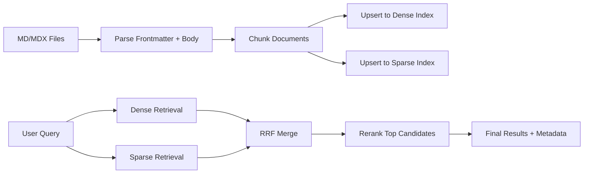

# Search Primer (For Non-Search Engineers)

This guide explains the search concepts used by `nextjs-pinecone-search` in practical terms.

## Core Concepts

### Dense search

- Think: semantic meaning.
- Good at matching related ideas even when exact words differ.
- Example: query `refund policy` can match text saying `returns and reimbursement`.

### Sparse search

- Think: keyword/lexical matching.
- Good at exact terms, names, acronyms, and uncommon vocabulary.
- Example: query `ERR_AUTH_Z42` needs exact token overlap.

### Hybrid search

- Dense + sparse together.
- You get semantic recall plus exact-word precision.

### RRF (Reciprocal Rank Fusion)

- A stable way to merge multiple ranked lists.
- If a document ranks well in both dense and sparse results, it gets boosted.

### Reranking

- Final pass that evaluates top candidates more carefully against the query.
- Improves ordering quality after retrieval.

## Why Chunking Exists

Embedding and sparse models have token limits. Long pages must be split.

This package uses paragraph-aware chunking with overlap so:

- each chunk fits model limits
- neighboring chunks keep context continuity
- huge paragraphs are still split safely

## End-to-End Flow

## Pinecone Terms Used Here

- `index`: the top-level Pinecone container.
- `namespace`: logical partition inside an index.
- `record`: one stored chunk plus metadata.
- integrated `embed` model: Pinecone converts text to vectors internally.

## Beginner Defaults You Can Keep

- `topK: 10`
- `rerankTopN: 10`
- `rebuildScope: "managed"`
- source-level `routePrefix` for clean URLs

These defaults are reasonable for most docs/blog sites.

## Common Misconceptions

- "I only need dense search."
Often false for docs. Sparse catches exact API names and codes better.

- "I should index full documents."
Usually worse. Chunking improves retrieval relevance and rerank quality.

- "If reindex succeeds, relevance must be good."
Not always. Relevance depends on chunk boundaries, metadata quality, and query wording.

## First Tuning Steps (If Results Feel Off)

1. Improve source content structure (clear headings, concise paragraphs).
2. Ensure titles/frontmatter are meaningful.
3. Adjust `topK` upward before changing deeper logic.
4. Inspect returned `sourcePath`, `urlPath`, and snippet text to verify what matched.
